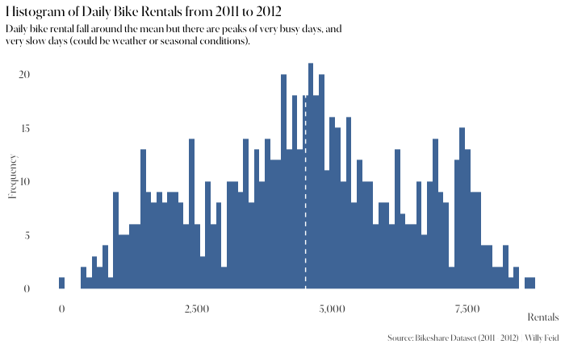
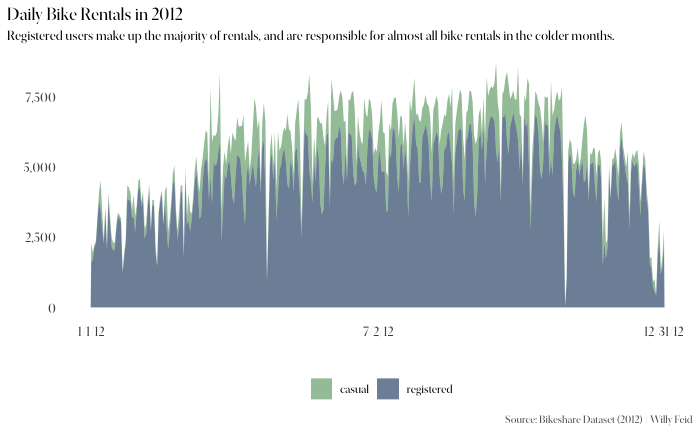

# Bikeshare Dataset Visualization

## Overview
This project involves the analysis and visualization of the Bikeshare dataset, covering the years 2011 and 2012. The primary focus is on creating various types of visualizations to understand the trends and patterns in bike rental data.

## Data Exploration and Cleaning
The data exploration section includes a detailed summary and cleaning of the dataset, covering aspects like renaming columns, imputing missing values, and reformatting data for analysis.

## Visualizations
Several types of visualizations have been created to analyze the dataset:

**Density Plot**:

---

---

---

---

---

---

---

## Tools and Technologies
- R and RStudio
- ggplot2 for visualizations
- dplyr for data manipulation

## Source
Data is sourced from the Bikeshare Dataset (2011 - 2012).

